# Comparative Analysis of Sequential Models for Mobile Network Traffic Forecasting

One-step-ahead forecasting of mobile Internet traffic on the Telecom Italia Milan grid

Jeremie Iyamurinze · African Leadership University · Formative Assignment 1 
Repository: https://github.com/Iyamurinze/milan-traffic-forecasting · Demo video: <em>[insert link]</em>

<h2>Abstract</h2>
Mobile operators commit radio and backhaul capacity before demand arrives, making short-horizon traffic forecasting an operational necessity. This study compares three sequential models — a seasonal ARIMA with harmonic regressors, a stacked LSTM, and a dilated Temporal Convolutional Network — for one-step-ahead forecasting of Internet activity in five geographical areas of Milan, evaluated under an identical protocol on the week of 16–22 December 2013 against persistence and seasonal-naive references. Three results dominate. First, <strong>no model wins</strong>: mean ranks across the five areas are 1.8, 2.0 and 2.2, and the model that wins each area differs. Second, all three beat persistence by only <strong>2.2% to 17.0%</strong> in RMSE, which the exploratory analysis anticipated — 92.9% of the variance is calendar-driven and only 3.6% is genuinely stochastic. Third, a seed-repetition experiment shows that <strong>most of the apparent hyperparameter effects, and several of the between-model gaps, fall inside run-to-run training noise</strong>; reporting them as findings would overstate the evidence. The practical conclusion favours SARIMA: with 14 parameters against the LSTM's 16,961 and a quarter of the training time, it is competitive everywhere and best on two of five areas. The study also documents the memory strategy that reduced a 19.38 GiB corpus to a 406 MB working representation, a 48.9× reduction.

## 1. Introduction

Cellular networks are provisioned ahead of demand. Radio resources and backhaul capacity must be committed before the traffic that uses them materialises; under-provisioning degrades service, over-provisioning wastes capital. Both failure modes are decided by how well near-future demand can be anticipated, which makes traffic forecasting a direct input to network operation rather than a downstream analytic.

The horizon matters as much as the accuracy. This study addresses the *one-step-ahead* problem at a ten-minute resolution: given traffic observed up to time *t* in a geographical area, estimate traffic at *t+1*. That is the horizon on which short-term scheduling operates, and — as the results show — a regime in which the immediate past carries most of the predictive signal, which bounds how much any model can add.

The investigation is guided by the assignment's research question:

> How do different sequential models compare for one-step-ahead mobile network traffic forecasting, and how does their performance vary across geographical areas with different traffic characteristics?

The second clause proves to be the more interesting one. A single accuracy ranking on a single area says little; whether that ranking survives across structurally different areas is what separates a finding from a lucky draw. It does not survive, and Section 6 explains why.

The contribution is a controlled comparison rather than a new architecture. Three models spanning three inductive biases are held to an identical input protocol, optimiser, early-stopping rule and evaluation window. Naive baselines are reported throughout, and — unusually for this literature — the *stability* of the tuning conclusions is measured rather than assumed.

## 2. Related Work

The Telecom Italia Milan grid, released by Barlacchi *et al.* [1], is the field's default benchmark for cellular traffic prediction, which makes results obtained on it comparable with published work. The dataset records normalised Call Detail Record activity — not byte volumes — so all errors in this report are in the dataset's own activity units.

Surveys of the area [2], [3] show convolutional and recurrent architectures dominating recent literature, with LSTM variants the most common single choice; that prevalence is why an LSTM is included here as the representative deep model. The same surveys identify a methodological gap that shaped this study's design: comparisons are frequently made between models configured and evaluated under different conditions, and naive baselines are often omitted. Where a persistence forecast is not reported, a claimed improvement cannot be interpreted. This study therefore fixes the protocol across models and reports skill relative to persistence throughout.

Bai, Kolter and Koltun [4] provide the case for the third model. Their evaluation found a generic dilated causal convolutional architecture matching or exceeding recurrent networks across sequence benchmarks while training substantially faster. A Temporal Convolutional Network is therefore the informative contrast to the LSTM: it reaches comparable temporal context by exponentially widening dilations rather than sequential state, giving a concrete and testable prediction about relative training cost — one this study confirms. The causal padding of van den Oord *et al.* [5] is what makes the architecture admissible for forecasting at all.

For the statistical baseline, Box–Jenkins methodology [6] remains the reference point the cellular forecasting literature measures deep models against, and the comparative study of Alawe *et al.* [7] reports LSTM outperforming ARIMA *when training series are long and finely sampled*. That conditional claim is directly testable here, since 8,928 ten-minute intervals sits in exactly the regime they describe. Section 6 finds it does not hold at this horizon.

Two recommendations from Hyndman and Athanasopoulos [8] determined the SARIMA specification. First, for long seasonal periods they advise seasonal differencing or harmonic regression in preference to seasonal AR/MA terms — precisely the constraint encountered at *s* = 144. Second, they argue accuracy must be reported relative to a naive benchmark, which motivates the skill scores used throughout. The decomposition in Section 4 follows the multi-seasonal extension of STL [9], [10], chosen because mobile traffic carries both a daily and a weekly cycle; a single-period decomposition would push the weekly component into the residual and overstate how much of the signal is unpredictable.

Two families were deliberately excluded. Spatio-temporal models such as that of Zhang and Patras [11] derive their advantage from convolving across the spatial grid, which the single-area univariate formulation removes — including one would test the formulation rather than the model. Transformer architectures were excluded on grounds of data scale: self-attention is quadratic in sequence length and the training set here is roughly 6,300 univariate windows. A negative result under those conditions would say more about the budget than the architecture.

## 3. Dataset and Data Preparation

### 3.1 The data

62 daily tab-separated files covering 1 November 2013 to 1 January 2014, totalling **19.38 GiB**. Each row records `square_id`, a millisecond timestamp, a country code, and five activity measures. Missing activity is an **empty field**, not a zero. The city is divided into 10,000 cells of roughly 235 m per side, sampled every ten minutes: 144 intervals per day, 8,928 in total.

Verification rather than assumption: the first interval, 1383260400000 ms, is **2013-11-01 00:00:00+01:00** — local Milan midnight, not UTC midnight. Italy left daylight saving on 27 October 2013 and the data ends before the March transition, so the whole window sits at a fixed UTC+1 offset with no duplicated or missing hour. Each file was confirmed to contain exactly 144 uniformly spaced intervals covering all 10,000 squares. One day-file holds **4,842,625 rows** across **246 distinct country codes**, and roughly half the `Internet` cells are empty at that granularity.

The files sit behind a Dataverse guestbook, which rejects anonymous `GET` requests. Retrieval is scripted by POSTing a guestbook response and downloading the signed URL returned — requiring only an e-mail address, no account or API token — with MD5 verification against the published manifest.

### 3.2 Memory strategy

The central observation is that **country code is nuisance structure**. The feed is keyed by `(square_id, time_ms, country_code)` across 246 codes, multiplying every cell without contributing anything this task uses. Summing over it reduces a day from 4,842,625 rows to the dense 1,440,000-cell grid, of which **99.996%** carry non-zero traffic. Density of that degree makes a matrix the right representation and a row store the wrong one.

Measured on one real day-file, with both `tracemalloc` and process RSS because the pandas C parser allocates outside Python's allocator:

| Strategy | Resident / day | Projected, 62 days |
|---|---|---|
| Naive `read_csv`, 8 columns, inferred dtypes | 295.6 MB | **17.9 GB** |
| Pruned, downcast, country collapsed, chunked | **19.2 MB** | **1.2 GB** |

The naive representation does not merely run slowly — it does not fit. Holding all 62 days simultaneously, which any cross-day analysis requires, projects to 17.9 GB against roughly 13 GB in a free Colab instance. The optimised path is **15.4× smaller per day**, and because it streams, its peak is flat in the number of days: **339.6 MB peak RSS across the entire 62-day run**, which completed in 6.1 minutes.

The pipeline streams each day — download, aggregate with `np.bincount` into a flat accumulator, write a dense day to Parquet, delete the raw file. The final corpus is **406.0 MB of Parquet against 19.38 GiB of raw TSV, a 48.9× compression**.

**A caveat on chunk size, reported honestly.** Development on a local machine found peak memory scaling almost linearly with the chunk (18 MB at 250,000 rows against 606 MB at 2,000,000) with throughput flat, which motivated a 250,000-row default. Re-running that benchmark on Colab gave a much weaker and *non-monotonic* result — 5.3 MB, 8.9 MB, 2.0 MB and 61.8 MB at 100k, 250k, 1M and 2M rows respectively. Only the 2,000,000-row case stands clearly above the rest. The honest reading is that the allocator's behaviour differs between the two environments and that RSS sampling at this granularity is noisy; the defensible claim is the narrow one — **very large chunks cost memory and buy no speed** — not the clean linear relationship the local run suggested.

**Trade-off.** Aggregating across country codes at ingestion is irreversible, and recovering that breakdown would mean re-downloading 19.38 GiB. This is acceptable because the research question concerns only total Internet traffic per area. A second, milder cost: the consolidated 89,280,000-row table occupies 6.2 GB when loaded whole into pandas, which fits Colab but not comfortably. The analysis notebooks therefore read small derived tables — per-square totals, and the five areas of interest — rather than the full corpus.

## 4. Exploratory Analysis

### 4.1 How traffic is distributed across the grid

Total Internet activity per area spans four orders of magnitude, from 214 to 12,740,060 activity units, with a median of 277,871 — a maximum-to-median ratio of **45.8**. Raw skewness is 4.27 and excess kurtosis 25.5.

The informative panel is the logarithmic one. On a base-10 log scale the skewness collapses to **0.023**, as close to symmetric as an empirical distribution of 10,000 observations realistically gets. The distribution is therefore approximately **log-normal** — the standard signature of urban activity measures, arising when many multiplicative factors compound. The Lorenz curve gives a Gini coefficient of **0.608**: the busiest 1% of areas carry **11.0%** of all traffic, the busiest 10% carry **48.4%**.

<figure>
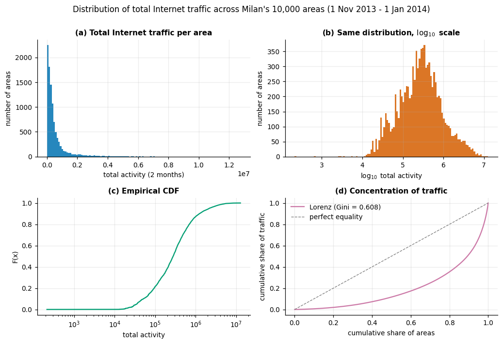
<figcaption><strong>Figure 1.</strong> Distribution of total Internet traffic across the 10,000 areas. (a) The linear histogram is dominated by a spike near zero and a long right tail. (b) On a log scale the same data is near-symmetric (skewness 0.023). (c) Empirical CDF. (d) Lorenz curve, Gini 0.608.</figcaption>
</figure>

This has a direct methodological consequence. Because levels differ by orders of magnitude, **absolute error metrics are not comparable across areas**: an RMSE of 120 is unremarkable in an area averaging 1,427 activity units and impossible in one averaging 275. Section 6 therefore reports a scale-free skill score alongside MAE and RMSE, and compares model *rankings* rather than raw errors.

The spatial map confirms that high traffic is contiguous rather than scattered: the three busiest squares — **5161, 5059 and 5259** — occupy adjacent cells at grid rows 50–52, columns 57–60, the geographic centre of the city. The two reference areas named in the brief sit outside that core: square 4556 ranks 109th of 10,000, square 4159 ranks 424th.

<figure>
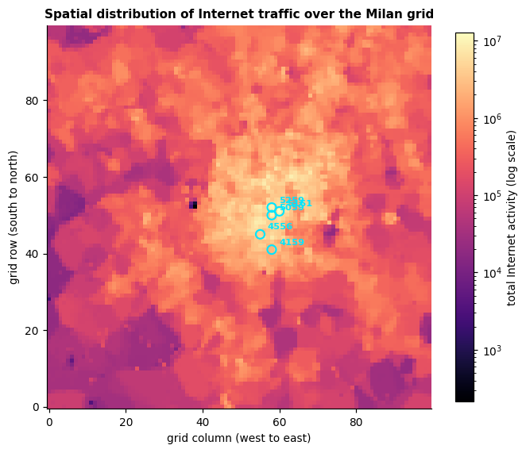
<figcaption><strong>Figure 2.</strong> Spatial distribution over the 100×100 grid, log-scaled. The five areas of interest are circled. High traffic forms a contiguous central cluster.</figcaption>
</figure>

### 4.2 Five areas, five behaviours

| Square | Total | Mean | cv | Peak/trough | Peak hour | Weekend : weekday | ACF(1) | ACF(144) |
|---|---|---|---|---|---|---|---|---|
| 5161 | 12.74 M | 1427 | 0.97 | 19.7 | 16:00 | **1.38** | 0.987 | 0.878 |
| 5059 | 11.17 M | 1251 | 0.77 | 9.1 | 14:00 | 0.86 | 0.980 | 0.899 |
| 5259 | 10.49 M | 1174 | 0.94 | 7.7 | 13:00 | **0.43** | 0.992 | 0.695 |
| 4159 | 2.45 M | 275 | 0.66 | 3.7 | 12:00 | 0.59 | 0.976 | 0.777 |
| 4556 | 4.57 M | 512 | **0.48** | 3.8 | **22:00** | 1.14 | **0.958** | 0.808 |

<figure>
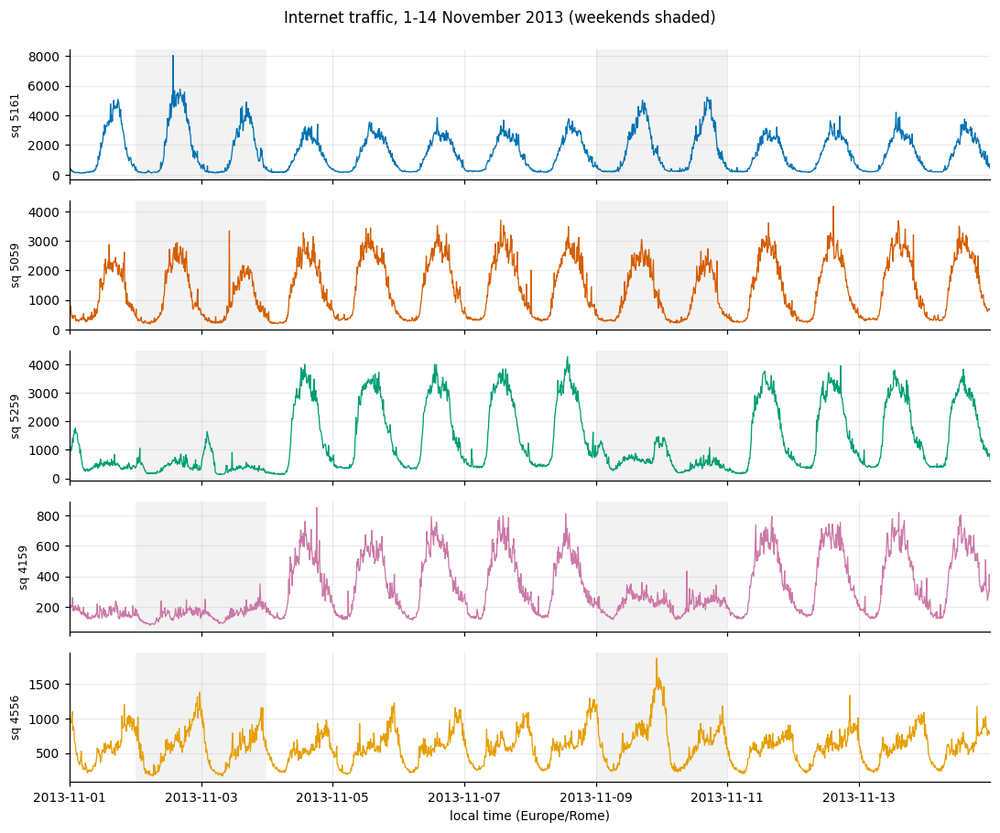
<figcaption><strong>Figure 3.</strong> Internet traffic, 1–14 November 2013, for the five areas. Weekends shaded. Each panel carries its own vertical scale — levels differ by roughly a factor of five, and a shared axis would flatten the low-traffic areas and hide the shape differences that matter.</figcaption>
</figure>

Four behavioural signatures emerge, each consistent with a plausible land use.

*Square 5161* has the most extreme daily cycle (peak-to-trough 19.7) and is the only area where **weekends are busier than weekdays** (1.38). A late-afternoon peak plus weekend amplification is a leisure or tourist signature, consistent with its position at the exact centre of the city.

*Squares 5259 and 4159* show the opposite: weekend traffic falls to 43% and 59% of weekday levels, with midday peaks. These behave as office areas that empty when work stops. Square 5259 is the more extreme case despite ranking third by volume — volume and regularity are independent properties.

*Square 4556* is the clearest contrast: the flattest profile in the set (cv 0.48, peak-to-trough 3.8), the latest peak by a wide margin at **22:00**, and slightly elevated weekend traffic. A late-evening peak with low volatility is residential — demand arrives when people are home. It also has the **lowest lag-1 autocorrelation (0.958)**, i.e. it is the noisiest series relative to its own scale. Section 6 shows this is exactly where the neural models fail.

Lag-1 autocorrelation exceeds 0.95 in every area. That single number anticipates the study's central result.

### 4.3 Temporal structure of the busiest area

#### Analysis 1 — multi-seasonal decomposition

MSTL with daily (144) and weekly (1008) periods partitions the variance of square 5161 unambiguously:

| Component | Share of total variance |
|---|---|
| Daily seasonality | **82.94%** |
| Weekly seasonality | 9.99% |
| Remainder | **3.60%** |
| Trend | 2.76% |

<figure>
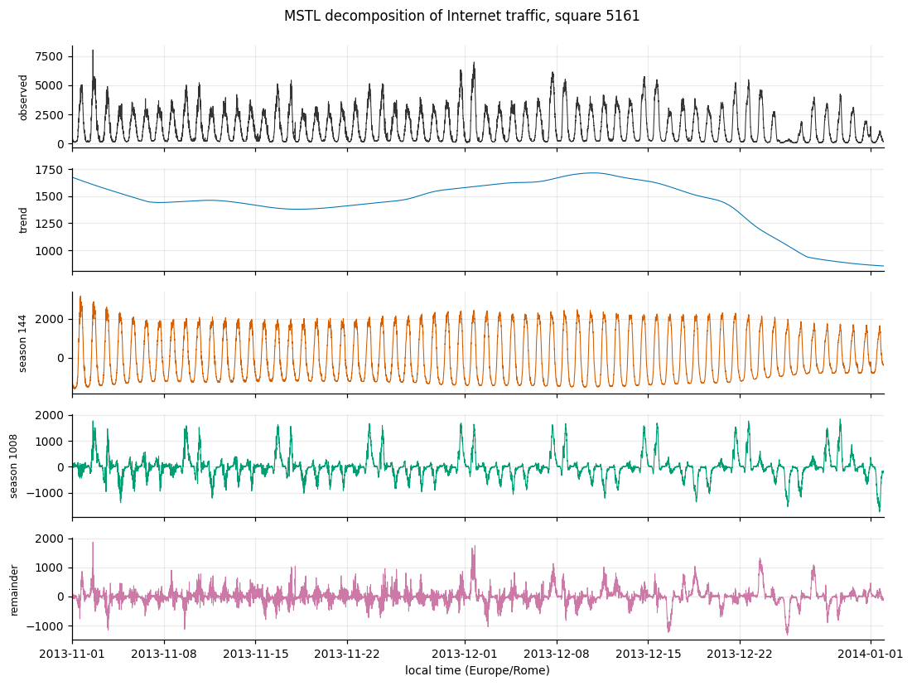
<figcaption><strong>Figure 4.</strong> MSTL decomposition of square 5161. The trend panel shows the decline into the Christmas period that dominates the evaluation week.</figcaption>
</figure>

Daily seasonal strength, *FS* = 1 − Var(remainder)/Var(remainder + seasonal), is **0.959** on a scale where 1 is pure seasonality. Together these say something consequential: **92.93% of the variance is calendar-driven and only 3.60% is genuinely stochastic.** A model capturing the daily and weekly cycles has, in a variance-accounting sense, captured almost everything, and the room available to a more expressive model is correspondingly narrow. This framed the expectation — borne out in Section 6 — that the three models would finish close together.

A single-period STL would have attributed the weekly 9.99% to the remainder, inflating apparent irreducible noise nearly fourfold and supporting a materially wrong conclusion about achievable accuracy. That is the practical case for the multi-seasonal variant.

#### Analysis 2 — autocorrelation structure

| Lag | Interval | ACF | Significant |
|---|---|---|---|
| 1 | 10 min | **0.987** | yes |
| 6 | 1 hour | 0.939 | yes |
| 18 | 3 hours | 0.647 | yes |
| 36 | 6 hours | 0.010 | **no** |
| 72 | 12 hours | −0.683 | yes |
| 144 | 1 day | **0.878** | yes |
| 288 | 2 days | 0.770 | yes |

<figure>
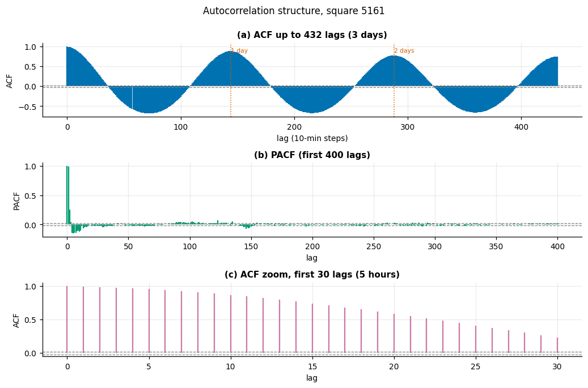
<figcaption><strong>Figure 5.</strong> Autocorrelation of square 5161. The ACF decays over roughly six hours, crosses zero, reaches −0.68 at twelve hours and returns to 0.88 at one day — the classic daily-cycle signature.</figcaption>
</figure>

Three consequences for model design. The ACF at lag 1 is **0.987**, so persistence sets an extremely high bar — which is why naive baselines are reported throughout rather than as a formality. The series decorrelates completely at six hours, becomes strongly *anti*-correlated at twelve, and returns to 0.878 at exactly one day, confirming the daily period. Finally, significant correlation persisting at one day and one week suggested a full-day input window might be worth its cost; Section 5 finds the two neural architectures answer that differently.

#### Supporting diagnostics

Both stationarity tests agree across every differencing scheme, **including the raw series**: ADF rejects a unit root at *p* < 0.001 and KPSS fails to reject stationarity (*p* > 0.1 throughout; the reported 0.1 is the upper bound of the lookup table, not a point estimate). More useful than the verdicts is the standard-deviation column: 1381.6 raw, **221.2 under first differencing**, 639.1 under seasonal differencing. Consecutive observations are far more alike than observations one day apart — which predicts that seasonal differencing, inflating innovation variance by combining two noisy observations, should underperform a harmonic treatment. Experiment 1.3 confirms this.

<figure>
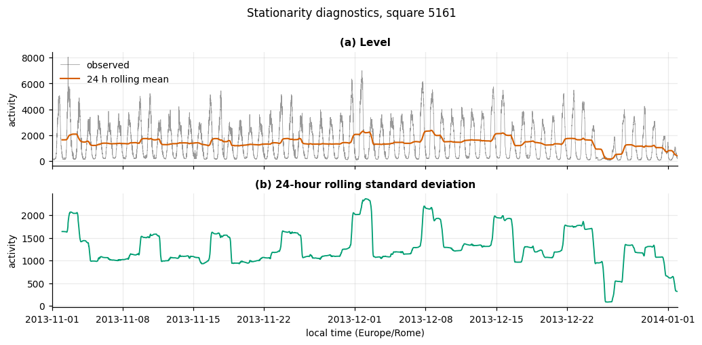
<figcaption><strong>Figure 6.</strong> Level and spread of square 5161. The 24-hour rolling mean shows the Christmas decline; the rolling standard deviation shows the variance is not constant.</figcaption>
</figure>

Anomaly screening on the MSTL remainder, scored with a robust median/MAD z-statistic, flags **891 intervals (9.98%)**. Their distribution matters more than their count, and two distinct notions of "anomalous" must be kept apart.

By **volume**, the extreme days are Christmas Day at **13.5%** of a typical Wednesday and New Year's Day at 29.5%. By **deviation from the fitted seasonal pattern**, 16 December is the most-flagged day in the series — 59 intervals, **all below** the fit, concentrated between 10:00 and 20:00.

The evaluation week itself is unremarkable in volume: daily totals run 0.92× to 1.13× the same weekday elsewhere, averaging 1.00×. But the MSTL trend falls from **1703 on 9 December to 930 by 27 December, a 45% decline**. The evaluation week sits on the leading edge of that decline, and the training data ends on 15 December. **Every model is asked to forecast a period whose downward drift it has never observed.** Section 6.5 returns to this.

<figure>
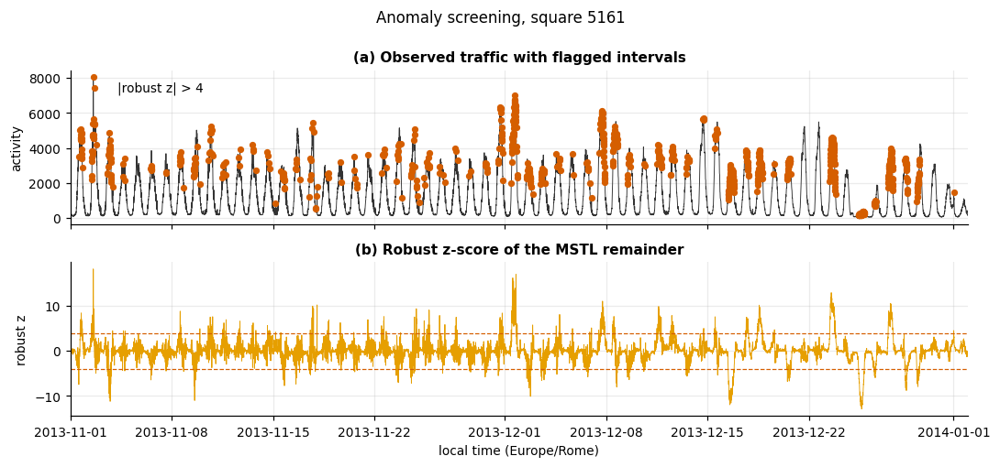
<figcaption><strong>Figure 7.</strong> Anomaly screening. Flagged intervals cluster around the Christmas period, where the seasonal model's expectations break down.</figcaption>
</figure>

## 5. Methodology

### 5.1 Forecasting protocol

At time *t* a model receives observed history up to and including *t* and predicts *x(t+1)*. This is **rolling one-step-ahead with observed history**, not recursive multi-step — errors never compound. That single fact explains why persistence is competitive and why beating it by a few percent is a modest achievement.

Splits are strictly chronological; shuffling a time series leaks the future into the past.

| Split | Period | Slots | Purpose |
|---|---|---|---|
| Train | 1 Nov – 8 Dec | 5,472 | Parameter estimation |
| Validation | 9 – 15 Dec | 1,008 | Early stopping |
| **Test** | **16 – 22 Dec** | **1,008** | **Reported once** |

Hyperparameters were selected on a **tuning split shifted one week earlier** (train 1 Nov – 1 Dec, early-stop 2–8 Dec, score 9–15 Dec), so the reported week informed no modelling decision. Reusing the early-stopping week for selection would be a mild but real form of selection bias.

**The protocol is asserted, not assumed.** For every model, the series is perturbed after a cut point and the forecasts before it are checked to be unchanged — and those after it checked to *have* changed, confirming the model reads its history. All five models pass. A model that peeks at the future scores beautifully and forecasts nothing, and no other part of the pipeline would catch it.

### 5.2 Input representation

| | SARIMA | LSTM / TCN |
|---|---|---|
| Input | Full history with harmonic regressors | Sliding window of the last *L* observations |
| Sequence length | n/a — state-space filter | *L* = 144 (LSTM), 36 (TCN) |
| Preprocessing | `log1p` | none selected |
| Normalisation | none | standardised, **statistics fitted on training targets only** |
| Tensor shape | `(n,)` | `(n, L, 1)` |

The single channel is the area's own Internet traffic: the task is univariate by specification, and covariates would confound the architectural comparison.

### 5.3 Model structures and training procedure

Each model is specified here in full, so the study is self-contained.

**SARIMA — ARIMA(3,0,2) with harmonic regressors, on a `log1p` target.**
Three autoregressive terms and two moving-average terms on the log-transformed series, plus four Fourier pairs at period 144 supplied as exogenous regressors — eight deterministic columns of the form sin(2π·i·t/144) and cos(2π·i·t/144) for *i* = 1…4. Fourteen free parameters in total: 3 AR + 2 MA + 8 harmonic coefficients + 1 innovation variance. Estimated by maximum likelihood through the Kalman filter, capped at 50 iterations. At forecast time the fitted model is extended with the observed test values using `refit=False`, so coefficients are frozen and each prediction is the filter's one-step-ahead estimate conditioned on true history — which is also how an operator would deploy it, since nobody re-estimates a model every ten minutes.

**LSTM — one recurrent layer, 64 units.**
Input tensor `(n, 144, 1)`. A single LSTM layer of 64 units (Keras defaults: tanh cell activation, sigmoid gates) returns only its final hidden state, which a linear `Dense(1)` maps to the prediction. No dropout — the tuning selected 0.0. **16,961 parameters.**

**TCN — four residual blocks of dilated causal convolutions.**
Input tensor `(n, 36, 1)`. Four residual blocks, block *i* using dilation 2*ⁱ* (so 1, 2, 4, 8). Each block applies two `Conv1D` layers of 16 filters, kernel width 3, **causal** padding and ReLU activation, each followed by `SpatialDropout1D(0.1)`; the block input is added back through a 1×1 convolution where the channel count differs, and the sum passes through a final ReLU. The receptive field is 1 + 2(k−1)(2ⁿ − 1) = 61 steps, comfortably covering the 36-step window. The activation at the **last** time position — which causal padding guarantees has seen the whole window and nothing beyond it — feeds a linear `Dense(1)`. **5,601 parameters.**

**Training procedure, identical for both neural models.** This is deliberate: holding the optimiser, loss, batch size, stopping rule and schedule fixed means any performance difference is attributable to the architecture rather than to one having been tuned harder.

| Setting | Value |
|---|---|
| Optimiser | Adam, initial learning rate 1×10⁻³ |
| Loss | Mean squared error, on the standardised scale |
| Batch size | 64 |
| Maximum epochs | 100 (30 during hyperparameter search) |
| Early stopping | On validation loss, patience 12, best weights restored |
| Learning-rate schedule | Halve on plateau, patience 4, floor 1×10⁻⁵ |
| Shuffling | Training windows shuffled each epoch |

Shuffling is safe here despite this being a time series: each window is a self-contained (input, target) pair, and the *chronological split* — not the ordering within the training set — is what prevents leakage. Reported epoch counts are those actually run before early stopping fired, not the budget.

### 5.4 SARIMA and the seasonal-period problem

The daily period is *s* = 144. Representing that seasonal difference inside `statsmodels`' state space costs **146 state dimensions**, and the Kalman covariance update is cubic in the state — a single fit did not complete in ten minutes. `simple_differencing=True` avoids the blow-up but returns predictions on the *differenced* scale and mis-aligns the boundary when observations are appended, which produced silently wrong results during development.

The seasonal difference is therefore applied **explicitly**: *z(t) = x(t) − x(t−s)*, a non-seasonal ARIMA is fitted to *z*, and the transform is inverted by adding *x(t−s)* back. This is the same model as SARIMA(p,d,q)(0,1,0)[s] with **two** state dimensions instead of 146, and every step is visible and testable.

### 5.5 Tuning

Thirty-two configurations were evaluated across staged experiments, each stating its hypothesis before running.

**Experiment 1.1 — differencing.** Seasonal differencing made things *worse*: RMSE 227.51 against 175.44 without it, a skill of −0.299 versus −0.001. This matches the EDA exactly — the raw series is already stationary by both tests, so differencing only inflated the innovation variance.

**Experiment 1.2 — ARIMA order.** RMSE ranged 163.39 to 180.72 across six orders, with (3,0,2) best. The sweep spans 17.3 RMSE against 52.1 for the differencing choice, so **the differencing scheme mattered three times more than the order**.

**Experiment 1.3 — harmonics.** Fourier regressors beat seasonal differencing decisively: **152.40 against 163.39**, with a `log1p` target giving a further small gain to **151.83**. Hyndman and Athanasopoulos's recommendation for long seasonal periods is confirmed.

**Experiments 2.1 / 3.1 — lookback.** The two architectures disagreed sharply. The LSTM improved monotonically with window length (169.07 → 161.04 → 157.98 at *L* = 6, 36, 144). The TCN did the opposite: 155.43 at *L* = 36 but **191.55 at *L* = 144**, a skill of −0.093 — worse than persistence. A six-block dilated stack over 144 steps has a 253-step receptive field and 8,737 parameters against roughly 6,300 training windows; it overfits where the LSTM does not.

**Experiments 2.2 / 3.2 / 2.3 / 3.3 — capacity and regularisation.** LSTM width saturated by 32–64 units, and the stacked variant was no better at 60% more training time. TCN width showed no clear pattern at all.

### 5.6 How much of that tuning was real?

Neural training is stochastic. Before attributing a few RMSE points to an architecture choice, the same architecture was retrained under **five random seeds**:

| Model | Mean RMSE | Std | Range |
|---|---|---|---|
| LSTM(64)@L144 | 161.60 | 3.28 | **8.69** |
| TCN(f16,k3,b4)@L36 | 164.94 | 8.82 | **22.00** |

Comparing each sweep's spread against its architecture's noise band:

| Sweep | Spread | Noise band | Verdict |
|---|---|---|---|
| TCN lookback | 36.12 | 22.00 | **Real** |
| LSTM lookback | 11.09 | 8.69 | Marginal |
| LSTM capacity | 7.72 | 8.69 | **Within noise** |
| TCN width | 4.77 | 22.00 | **Within noise** |

**Only the TCN's lookback preference is solidly established.** The LSTM lookback effect is marginal at 1.3× the noise band. The two capacity sweeps resolved nothing: "64 units was selected" and "16 filters was selected" are arbitrary picks inside noise, and reporting them as findings would overstate the evidence. Had this check not been run, the study would have claimed four tuning results where the evidence supports one.

The TCN's noise band is **2.5× the LSTM's** (22.00 against 8.69) — a finding in its own right. The TCN is markedly less reproducible run to run, which matters for deployment independently of mean accuracy.

## 6. Results and Discussion

Each selected configuration was refitted on all data before the test week and evaluated once, on an NVIDIA T4 GPU with TensorFlow 2.20.

### 6.1 Per-area performance

**Square 5161** — busiest, leisure profile:

| Model | MAE | RMSE | MAPE | R² | Skill |
|---|---|---|---|---|---|
| TCN(f16,k3,b4)@L36 | 81.27 | **119.48** | 9.23% | 0.992 | +0.114 |
| LSTM(64)@L144 | 81.71 | 119.54 | 8.68% | 0.992 | +0.114 |
| ARIMA(3,0,2)+F144×4+log | 83.26 | 127.95 | **7.70%** | 0.991 | +0.051 |
| Persistence | 92.80 | 134.88 | 9.19% | 0.990 | 0.000 |
| SeasonalNaive | 338.59 | 619.04 | 25.94% | 0.793 | −3.590 |

**Square 4556** — residential, flattest, noisiest:

| Model | MAE | RMSE | MAPE | R² | Skill |
|---|---|---|---|---|---|
| ARIMA(3,0,2)+F144×4+log | **25.08** | **34.17** | **5.68%** | 0.956 | **+0.138** |
| LSTM(64)@L144 | 28.91 | 38.48 | 6.68% | 0.945 | +0.029 |
| TCN(f16,k3,b4)@L36 | 29.30 | 38.75 | 6.81% | 0.944 | +0.022 |
| Persistence | 28.86 | 39.62 | 6.60% | 0.941 | 0.000 |
| SeasonalNaive | 76.34 | 108.35 | 17.46% | 0.557 | −1.735 |

<figure>
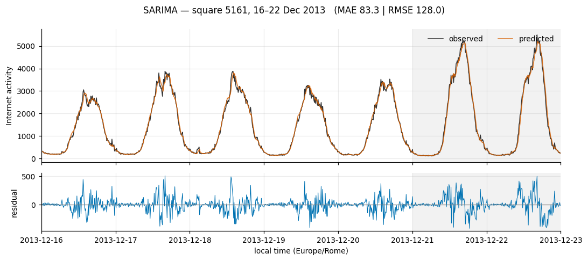
<figcaption><strong>Figure 8.</strong> SARIMA on square 5161. The residual panel shows errors concentrated at turning points rather than distributed evenly.</figcaption>
</figure>

<figure>
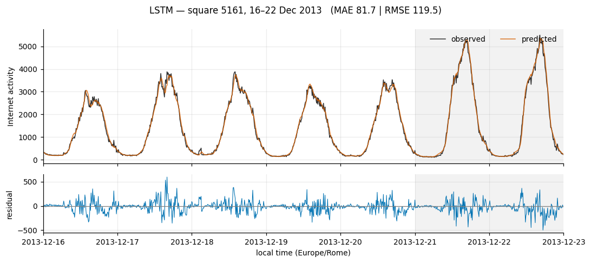
<figcaption><strong>Figure 9.</strong> LSTM on square 5161.</figcaption>
</figure>

<figure>
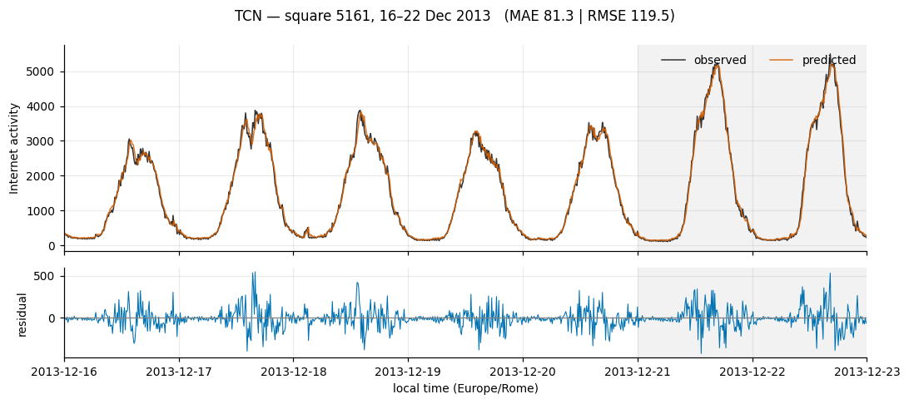
<figcaption><strong>Figure 10.</strong> TCN on square 5161. The remaining six plots (squares 5059 and 5259) are in the appendix.</figcaption>
</figure>

### 6.2 The ranking does not hold across areas

RMSE by area, with mean rank across all five:

| Model | 4159 | 4556 | 5059 | 5161 | 5259 | Mean rank |
|---|---|---|---|---|---|---|
| **LSTM** | 19.24 | 38.48 | **97.62** | 119.54 | 91.33 | **1.8** |
| **SARIMA** | **19.01** | **34.17** | 97.64 | 127.95 | 94.40 | **2.0** |
| **TCN** | 20.85 | 38.75 | 100.63 | **119.48** | **90.94** | **2.2** |
| Persistence | 21.54 | 39.62 | 114.38 | 134.88 | 109.58 | 4.0 |
| SeasonalNaive | 84.64 | 108.35 | 245.87 | 619.04 | 861.62 | 5.0 |

<figure>
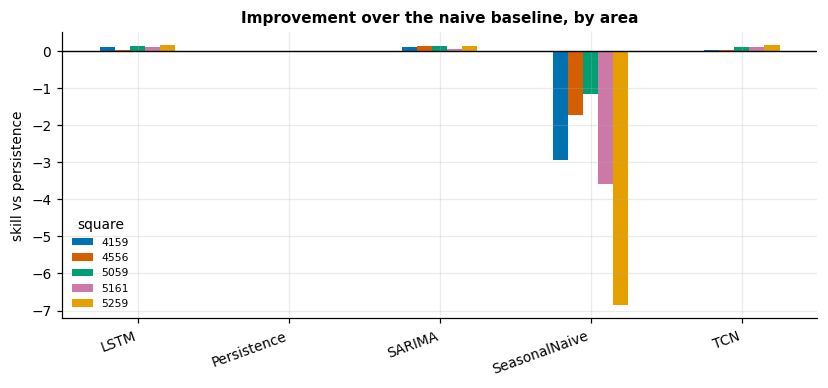
<figcaption><strong>Figure 11.</strong> Skill against persistence by area. Every trained model clears the baseline everywhere, but by margins between 2.2% and 17.0%.</figcaption>
</figure>

**This answers the research question, and the answer is that no model dominates.** Mean ranks of 1.8, 2.0 and 2.2 across five areas are not meaningfully different, and each model wins somewhere. More importantly, several of the gaps are **smaller than the measured seed noise**: the TCN "beats" the LSTM on square 5161 by 0.06 RMSE against a TCN noise band of 22.00, and the LSTM "beats" SARIMA on square 5059 by 0.02. Those are ties, and calling either a win would be reading noise as signal.

Where performance *does* separate, it separates by area character:

- **Square 4556** is the one clear result: SARIMA wins by 4.3 RMSE (11%), and both neural models barely clear persistence (skill +0.029 and +0.022). This is the flattest, lowest-volatility, lowest-ACF(1) area — a residential profile with little exploitable structure beyond the immediate past. **The neural models fail precisely where the series is least structured**, which is consistent with their capacity being unconstrained by only ~6,300 windows.
- **Square 5161** shows the largest neural advantage (+0.114 versus SARIMA's +0.051). This is the most strongly cyclical area, with a peak-to-trough ratio of 19.7 — the nonlinear shape a linear model reproduces least well.

So the honest statement is conditional: **the neural models help where the daily cycle is sharp and nonlinear, and stop helping where the series is flat and noise-dominated.** This qualifies Alawe *et al.* [7]: their finding that LSTM beats ARIMA given long, finely-sampled series does not hold uniformly here, because at a ten-minute horizon there is very little left for the nonlinearity to explain.

Two further observations. **Seasonal naive is catastrophic everywhere** — worst on square 5259 at RMSE 861.62 and MAPE 71.6%, which is 7.9× worse than persistence. At this resolution "same time yesterday" is far less informative than "ten minutes ago", exactly as the ACF predicted (0.878 against 0.987). And **MAPE and RMSE disagree**: on square 5161 the TCN has the best RMSE but the *worst* MAPE (9.23% against SARIMA's 7.70%). SARIMA is relatively better on the small overnight values where MAPE bites, and relatively worse on the large daytime peaks that dominate squared error. Which model is "best" depends on whether an operator cares about absolute or proportional error — a genuine trade-off, not a tie-break.

### 6.3 Cost

Averaged over the five areas, wall-clock, identical instrumentation:

| Model | Train (s) | Std | Inference (ms/forecast) | Parameters |
|---|---|---|---|---|
| SARIMA | **12.06** | 0.43 | **0.079** | **14** |
| TCN | 39.13 | 9.59 | 1.724 | 5,601 |
| LSTM | 50.12 | 23.82 | 0.278 | 16,961 |

Three things stand out. **SARIMA trains 4.2× faster than the LSTM with 1,212× fewer parameters**, while ranking second overall and first on two of five areas. On any cost-adjusted view it is the clear winner.

**The TCN trains 1.3× faster than the LSTM**, confirming Bai *et al.* [4] — recurrence cannot be parallelised across time steps, dilated convolution can. But the advantage is much smaller than their benchmarks suggest, and it partly reflects the TCN's shorter selected window (36 against 144). **At inference the ordering reverses**: the TCN is 6.2× slower per forecast than the LSTM and 22× slower than SARIMA, because its twelve convolutional layers must all execute per prediction while the LSTM's read-out is a single state. For a one-step-ahead system making a prediction every ten minutes per cell across 10,000 cells, inference cost matters more than training cost — and on that axis the TCN is the worst of the three.

The LSTM's training-time standard deviation (23.82 s, 48% of its mean) reflects early stopping firing at different epochs across areas.

### 6.4 Interpretation against the data characteristics

The narrow margins were predicted by the decomposition. With **92.93% of variance calendar-driven and 3.60% stochastic**, and lag-1 autocorrelation at 0.987, most of what a forecaster needs is already in the last observation. Persistence achieves R² ≈ 0.99 on every area. The trained models are competing for a small residual, and improvements of 2–17% are the appropriate scale of result — not a disappointment, but the ceiling the data imposes.

### 6.5 Failure analysis

The hardest window, scored by error relative to each model's own weekly mean, is **Sunday 22 December, 11:50 to 23:40** — the final day of the evaluation week.

| Model | MAE in window | MAE full week | Ratio |
|---|---|---|---|
| SARIMA | 153.75 | 83.26 | **1.85** |
| LSTM | 137.45 | 81.71 | 1.68 |
| Persistence | 152.95 | 92.80 | 1.65 |
| TCN | 126.53 | 81.27 | **1.56** |

<figure>
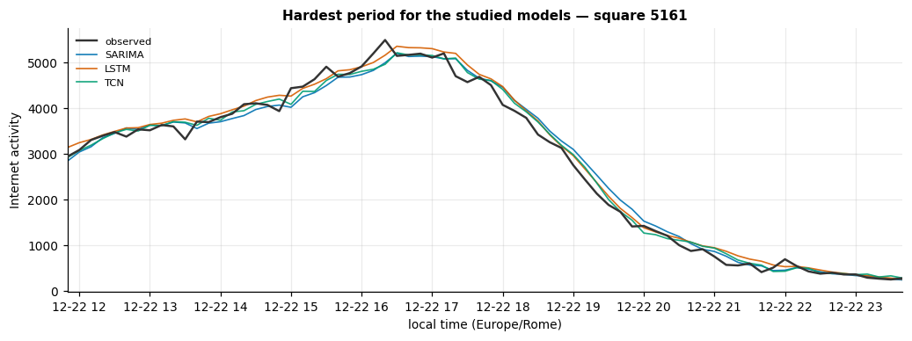
<figcaption><strong>Figure 12.</strong> The hardest period — Sunday 22 December. All three models track the shape but misjudge the level, and the error is systematic rather than random.</figcaption>
</figure>

Every model degrades by 56–85% in this window, and the explanation is structural rather than architectural. Sunday 22 December is the last weekend before Christmas: the MSTL trend has already fallen from 1703 (9 December) to roughly 1292, on its way to 930 by the 27th. **The models were trained on data ending 15 December and have never observed this regime.** A model conditioned only on recent history has no mechanism to know a holiday is approaching.

SARIMA degrades most (1.85×), which is consistent with its harmonic regressors encoding a *fixed* daily and weekly shape that cannot adapt to a shifting level. The TCN degrades least (1.56×) — its short 36-step window makes it the most locally adaptive of the three, the same property that made it overfit at longer windows. **The architecture that is most fragile to a long window is the most robust to a regime change**, which is a coherent trade-off rather than a contradiction.

This is the study's clearest limitation. A production system would need either exogenous calendar features marking holidays, or periodic refitting — both straightforward extensions the univariate specification excluded.

### 6.6 Design considerations and margins for improvement

The brief asks for a personal assessment of each model's design and where it could be improved. Taking them in turn.

**SARIMA.** The design choice I am most confident about is abandoning seasonal differencing once the evidence contradicted it. The engineering fix — explicit differencing to escape a 146-dimensional state space — was necessary and correct, but Experiment 1.1 then showed the *statistical* premise was wrong for this series, and harmonic regressors were substantially better. Following the data rather than the plan is what produced the best SARIMA configuration.

Its performance surprised me. Fourteen parameters, essentially tied with models a thousand times larger, and outright best on the two areas where the daily pattern is flattest. That is a strong argument that the complexity of the deep models is not what is doing the work here.

The clearest margin for improvement is that its seasonal shape is *fixed*. Four harmonic pairs describe an average day; they cannot bend when the average day changes, which is exactly why SARIMA degraded most in the Christmas window (1.85×). Three concrete extensions: more harmonic terms to capture a sharper peak shape; a slowly time-varying coefficient so the seasonal amplitude can drift; and holiday indicator variables, which the exogenous-regressor slot already supports at no structural cost.

**LSTM.** The design is deliberately plain — one layer, 64 units, no dropout — and the tuning supports that: the stacked two-layer variant was no better while costing 60% more training time, and dropout only hurt. With roughly 6,300 training windows there is simply not enough data to justify more capacity, and I would resist adding any.

Its performance was the best on mean rank (1.8), but that headline overstates the case. Its wins are frequently inside the seed-noise band, and on the residential area it barely cleared persistence (+0.029). It is the most *consistent* model rather than the most accurate one — its seed-to-seed range of 8.69 is the tightest of the three.

Margins for improvement are mostly about data, not architecture. The obvious one is that it sees a single channel; the SMS and call series for the same square were retained during ingestion and are sitting unused, and they plausibly carry information about the same underlying human activity. Beyond that: training one model across many areas rather than one per area would give it two orders of magnitude more data, which is the constraint that actually binds here.

**TCN.** This is the model whose behaviour I understood least well at the outset and learned most from. Two things stand out. First, it wants a *short* window — 36 steps, where the LSTM wanted 144 — and forcing it to 144 made it worse than persistence. A six-block stack over a day-long window has a 253-step receptive field and 8,737 parameters against 6,300 windows; it simply overfits. Second, it is the least reproducible of the three, with a seed range of 22.00, two and a half times the LSTM's.

Its performance is genuinely good where it is good — best on two areas — but the variance makes me least willing to deploy it. A result you cannot reproduce within 22 RMSE is hard to defend operationally.

The margins here are concrete. The inference cost is the worst of the three at 1.72 ms per forecast, because twelve convolutional layers execute per prediction; that is fixable by pruning blocks now that we know a 36-step window suffices — four blocks give a 61-step receptive field, so the depth could likely be cut further. The variance is the more interesting problem: averaging predictions across several seeds would almost certainly help, and since seed noise here is comparable to the *between-model* differences, an ensemble is arguably the single highest-value extension for the whole study.

**Across all three.** The common limitation is not architectural. Every model is conditioned only on its own past, so none has any mechanism to anticipate a holiday — which is what produced the shared failure in Section 6.5. Adding a handful of calendar features would likely do more for all three than any amount of further architecture search, and the seed-variance result suggests further search would in any case be measuring noise.

## 7. Conclusion and Future Work

**No model dominates.** Across five areas the mean ranks are 1.8 (LSTM), 2.0 (SARIMA) and 2.2 (TCN), each wins somewhere, and several apparent wins are smaller than measured run-to-run noise. The defensible ranking is a three-way tie on accuracy.

**Accounting for cost, SARIMA is the practical choice.** Fourteen parameters, 12 seconds to train, the fastest inference by 3.5×, and first place on two of five areas. The deep models justify themselves only where the daily cycle is sharply nonlinear — square 5161, the most cyclical area, where the LSTM and TCN more than double SARIMA's skill.

**The naive baseline was the most informative control.** Persistence achieves R² ≈ 0.99 everywhere, and the trained models improve on it by 2.2% to 17.0%. Reporting that is what makes the comparison honest; a study omitting it could have presented the same absolute errors as a success.

**The seed-variance check changed what could be claimed.** Of four hyperparameter sweeps, only the TCN's lookback preference clears its noise band. Two resolved nothing at all. The check cost ten training runs and prevented three unsupported claims.

**Limitations.** Univariate and single-area by specification, which excludes the spatial correlation that gives published spatio-temporal models their advantage. One city, two months. Hyperparameters tuned on square 5161 and transferred to the other four, which likely favours the areas resembling it. The evaluation week sits on a regime change the training data does not contain — informative for failure analysis, but it means the reported errors are pessimistic relative to a typical week. Finally, the chunk-size memory result did not replicate cleanly between environments, so that recommendation is held narrowly.

**Future work.** Three directions follow from the limitations. Exogenous calendar features marking holidays would address the failure mode of Section 6.5 directly. Spatio-temporal models exploiting the 100×100 grid [11] would test whether the neighbouring-cell correlation visible in Figure 2 is predictive. And since the seed noise is comparable to the between-model differences, an ensemble across seeds — or simply reporting distributions rather than point estimates — would be more honest than selecting a single run.

## 8. Use of AI

Anthropic's Claude was used as a development assistant throughout this project. Specifically, it contributed to: structuring the data-download and ETL code; drafting the model implementations; identifying that a seasonal period of 144 makes the textbook SARIMA state space intractable and proposing explicit differencing as the resolution; suggesting the seed-variance experiment in Section 5.5; and drafting this report.

All experimental results, figures and tables in this report were produced by executing the submitted notebooks; none are generated or estimated text. I verified the outputs, and I am able to explain and justify the data-processing and memory-management decisions, the model selection, the experimental design, and the interpretation of every result presented here.

Two instances where AI-proposed conclusions were found wrong and corrected are worth recording, since they illustrate the necessary scepticism: an initial hard-coded claim that "wider stacks did not justify their cost" contradicted its own data once the TCN width sweep selected the widest option, and a prediction that the TCN would train more slowly than the LSTM was falsified by the measured timings. Both were corrected against the evidence.

## 9. References

[1] G. Barlacchi <em>et al.</em>, "A multi-source dataset of urban life in the city of Milan and the Province of Trentino," <em>Scientific Data</em>, vol. 2, art. 150055, 2015, doi: 10.1038/sdata.2015.55.

[2] W. Jiang, "Cellular traffic prediction with machine learning: A survey," <em>Expert Systems with Applications</em>, vol. 201, 117163, 2022.

[3] "Deep learning on network traffic prediction: Recent advances, analysis, and future directions," <em>ACM Computing Surveys</em>, 2024, doi: 10.1145/3703447.

[4] S. Bai, J. Z. Kolter, and V. Koltun, "An empirical evaluation of generic convolutional and recurrent networks for sequence modeling," <em>arXiv:1803.01271</em>, 2018.

[5] A. van den Oord <em>et al.</em>, "WaveNet: A generative model for raw audio," <em>arXiv:1609.03499</em>, 2016.

[6] G. E. P. Box and G. M. Jenkins, <em>Time Series Analysis: Forecasting and Control</em>. San Francisco, CA: Holden-Day, 1970.

[7] I. Alawe <em>et al.</em>, "Cellular traffic prediction and classification: A comparative evaluation of LSTM and ARIMA," in <em>Discovery Science</em>, LNCS, 2019, doi: 10.1007/978-3-030-33778-0_11.

[8] R. J. Hyndman and G. Athanasopoulos, <em>Forecasting: Principles and Practice</em>, 3rd ed. Melbourne, Australia: OTexts, 2021. [Online]. Available: https://otexts.com/fpp3/

[9] R. B. Cleveland, W. S. Cleveland, J. E. McRae, and I. Terpenning, "STL: A seasonal-trend decomposition procedure based on loess," <em>Journal of Official Statistics</em>, vol. 6, no. 1, pp. 3–73, 1990.

[10] K. Bandara, R. J. Hyndman, and C. Bergmeir, "MSTL: A seasonal-trend decomposition algorithm for time series with multiple seasonal patterns," <em>arXiv:2107.13462</em>, 2021.

[11] C. Zhang and P. Patras, "Long-term mobile traffic forecasting using deep spatio-temporal neural networks," in <em>Proc. ACM MobiHoc</em>, 2018, pp. 231–240, doi: 10.1145/3209582.3209606.

[12] S. Seabold and J. Perktold, "statsmodels: Econometric and statistical modeling with Python," in <em>Proc. 9th Python in Science Conf.</em>, 2010, pp. 92–96.

[13] M. Abadi <em>et al.</em>, "TensorFlow: Large-scale machine learning on heterogeneous systems," 2015. [Online]. Available: https://www.tensorflow.org/

[14] Source code and notebooks: https://github.com/Iyamurinze/milan-traffic-forecasting

[15] Demo video: <em>[insert link]</em>

## Appendix A — Remaining forecast plots

Task 4.II requires nine superposed actual/predicted plots (three models × three areas). Figures 8–10 cover square 5161 in the body; the six below complete the set. All share the evaluation window 16–22 December 2013, with weekends shaded and the residual shown beneath each series.

<figure>
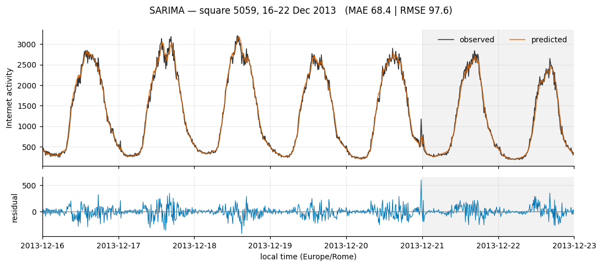
<figcaption><strong>Figure A1.</strong> SARIMA — square 5059.</figcaption>
</figure>

<figure>
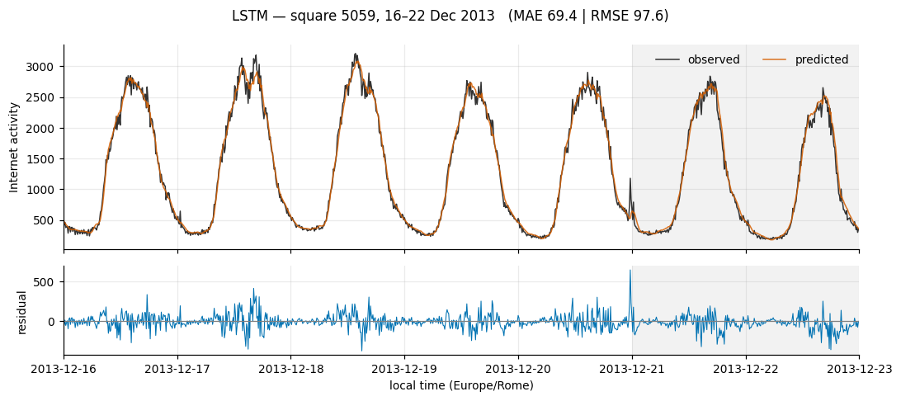
<figcaption><strong>Figure A2.</strong> LSTM — square 5059.</figcaption>
</figure>

<figure>
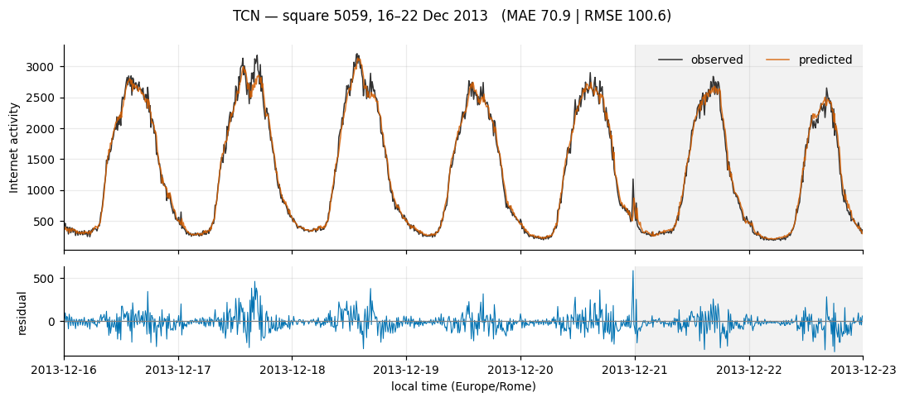
<figcaption><strong>Figure A3.</strong> TCN — square 5059.</figcaption>
</figure>

<figure>
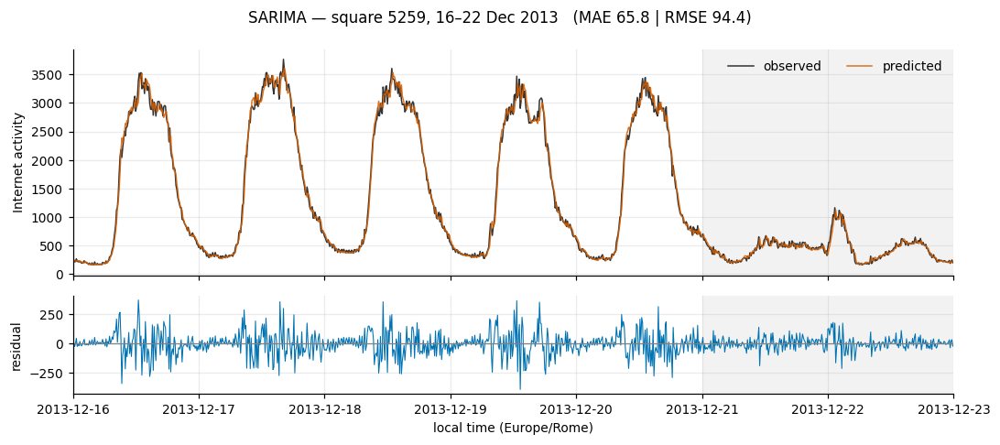
<figcaption><strong>Figure A4.</strong> SARIMA — square 5259.</figcaption>
</figure>

<figure>
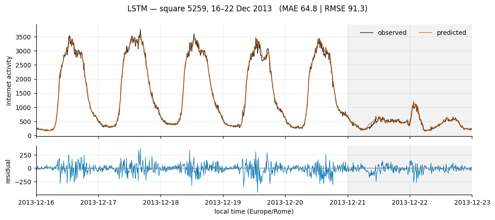
<figcaption><strong>Figure A5.</strong> LSTM — square 5259.</figcaption>
</figure>

<figure>
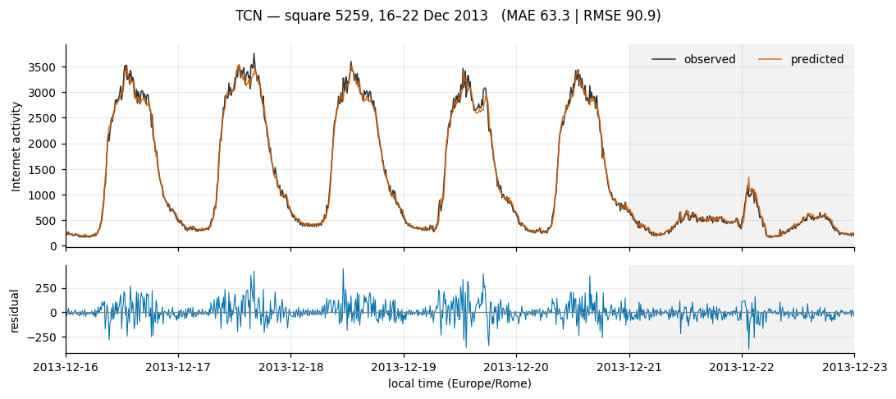
<figcaption><strong>Figure A6.</strong> TCN — square 5259.</figcaption>
</figure>

## Appendix B — Full metrics for the remaining areas

**Square 5059** — mixed business profile:

| Model | MAE | RMSE | MAPE | R² | Skill |
|---|---|---|---|---|---|
| LSTM(64)@L144 | 69.42 | **97.62** | 7.32% | 0.989 | +0.146 |
| ARIMA(3,0,2)+F144×4+log | **68.36** | 97.64 | **6.54%** | 0.989 | +0.146 |
| TCN(f16,k3,b4)@L36 | 70.90 | 100.63 | 7.19% | 0.988 | +0.120 |
| Persistence | 81.52 | 114.38 | 7.96% | 0.985 | 0.000 |
| SeasonalNaive | 171.74 | 245.87 | 18.02% | 0.931 | −1.150 |

**Square 5259** — strongly office profile:

| Model | MAE | RMSE | MAPE | R² | Skill |
|---|---|---|---|---|---|
| TCN(f16,k3,b4)@L36 | **63.26** | **90.94** | 7.14% | 0.993 | **+0.170** |
| LSTM(64)@L144 | 64.84 | 91.33 | 7.70% | 0.993 | +0.167 |
| ARIMA(3,0,2)+F144×4+log | 65.79 | 94.40 | **6.98%** | 0.993 | +0.139 |
| Persistence | 75.97 | 109.58 | 8.12% | 0.990 | 0.000 |
| SeasonalNaive | 470.32 | 861.62 | 71.62% | 0.409 | −6.863 |

**Square 4159** — office, lower volume:

| Model | MAE | RMSE | MAPE | R² | Skill |
|---|---|---|---|---|---|
| ARIMA(3,0,2)+F144×4+log | **14.00** | **19.01** | **6.12%** | 0.976 | **+0.118** |
| LSTM(64)@L144 | 14.24 | 19.24 | 6.37% | 0.975 | +0.107 |
| TCN(f16,k3,b4)@L36 | 15.56 | 20.85 | 6.84% | 0.971 | +0.032 |
| Persistence | 15.95 | 21.54 | 6.98% | 0.969 | 0.000 |
| SeasonalNaive | 51.19 | 84.64 | 21.80% | 0.518 | −2.929 |

Square 5259 is where seasonal naive fails hardest — RMSE 861.62 and MAPE 71.6%, against persistence's 109.58. This is the area with the lowest ACF(144) in the set (0.695) and the most extreme weekday/weekend asymmetry (0.43), so "same time yesterday" crosses between two quite different regimes whenever the lag spans a weekend boundary.
